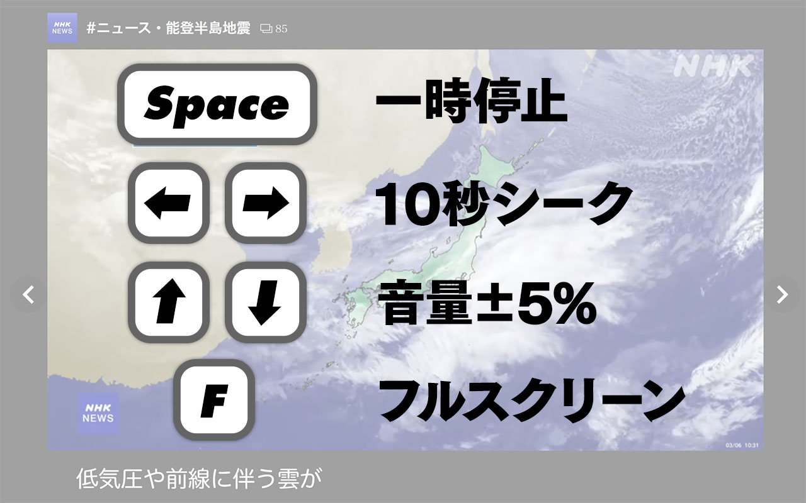

# NHKプラス クイックコントロール
NHKプラスでYouTube風ショートカットキーを使えるようにするChrome拡張機能です。

（旧名：NHKプラス like YouTube）

## 機能
### 動画のクイックコントロール
再生エリアにフォーカスが当たっているとき、次のショートカットキーが有効になります。

- `スペース` 一時停止⇔再生
- `←` `→` 10秒シーク
- `↑` `↓` 音量5%増減
- `F` フルスクリーン切り替え
  - ブラウザ機能を使っているのでNHKプラス側の字幕などは出なくなります

### 再生画面左上の `NHK+` ロゴを普通のリンクにする
Ctrl+クリックとかホイールクリックが効かない問題を解消します。

## 謝辞
https://github.com/92thunder/npp の実装を参考にさせていただきました。ありがとうございます。

## LICENSE
MIT License
